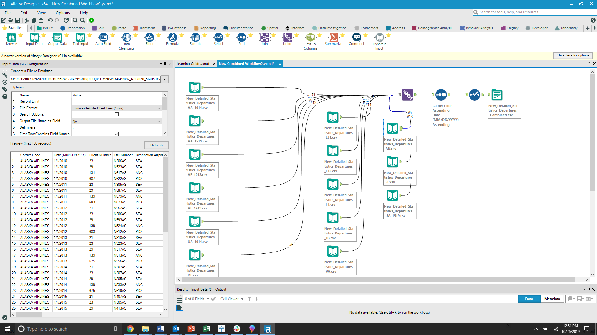
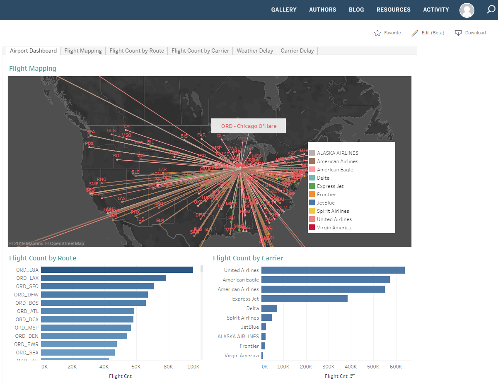
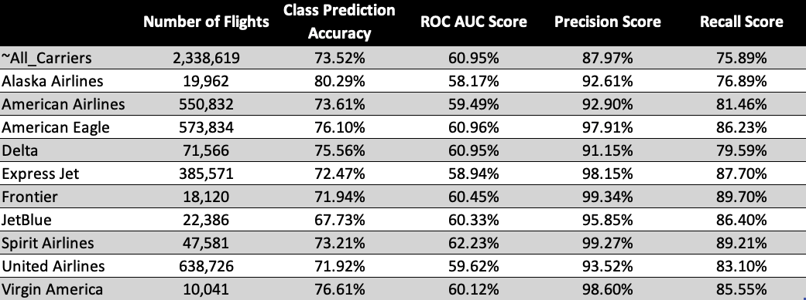
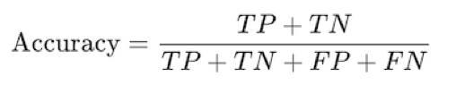
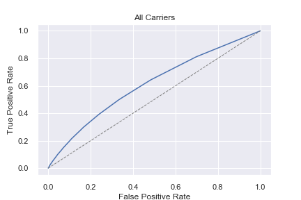
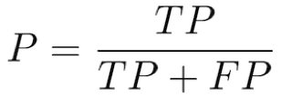
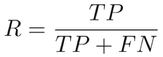
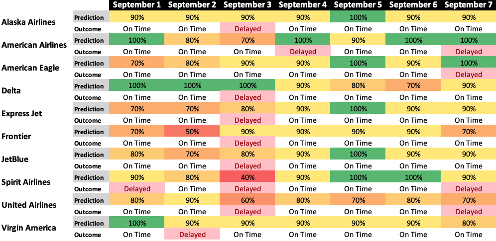
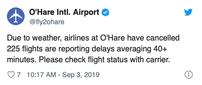

## Flight Delay Prediction Model ##
 <br /> Project 3 : Telling a Story with Data Visualization <br />

## Analyzing the Bureau of Transportation Statistics Data ##
 <br />

 ### Team Members : Marylu Granja , Cesar Martinez , Saj Khan 
 
 <br />
 
 

<br />
Apply Data Science packages to create a machine learning model and tell a story with data visualization BI Tools.
<br />
We used the following resources for the project:
<br />
Python
<br />
Pandas 
<br />
Python Matplotlib 
<br />  
Cloud-Amazon AWS
<br />
Tableau
<br />
 
 ## Summary

<br />

For this project we analyzed the Air Traffic Data downloaded from the US Bureau of Transportation Statistics for Chicago O'Hare Airport.

<br />

*https://www.transtats.bts.gov/ONTIME/Departures.aspx.*

<br />

### ETL - Bureau of Transportation Statistics Data

The bureau provided indivisual csv files for each airlines. We used an Alteryx workflow to combine all the files into one csv file for easier consumption via Tableau for our visualization exercise. 
We also used Alteryx to sort our data by Airline and by day and also we dropped a few unwanted columns to make the size of the file smaller.



We leveraged Tableau to create basic visualizations to understand the robustness of our data and to find the busiest routes and airlines.

<br />



<br />

*https://public.tableau.com/profile/saj.khan6439#!/vizhome/flightdata_Saj/AirportDashboard?publish=yes*

<br />
We then analyzed data from 2010 to 2018 to build a predictive model using scikit learn and Random Forest to predict the likely hood of a particular flight being delayed.

<br />

Furthermore using API calls from *https://www.flightstats.com/v2/* we compared the 2019 actual data with our predictive model to understand whether our model is a good fit.
<br />

## Machine Learning

For the prediction Machine Learning strategy we chose Random Forest Classifer. The data set was transformed to prepare it for the various models -- one for all the carriers and indiviual models for each carrier.

``` SQL
-- transform data from Bureau
create table model_data_all as
select carrier_code, date_part('month', flight_date) as month, date_part('day', flight_date) as day_of_month, 
	date_part('isodow', flight_date) as day_of_week, 'ORD' as origin, destination_airport as destination, 
	to_char(departure_time_scheduled, 'HH24MI') as departure_time,
	case 
		when departure_delay >= 15 then 1
		else 0 end as is_delay
		
from flights

alter table model_data_all alter column departure_time type integer using departure_time::integer

-- All Carriers
create table model_data_final_all as

select month, day_of_month, day_of_week, origin, destination, floor(departure_time / 100) as departure_time, is_delay as delayed

from model_data_all;

-- American Airlines

create table model_data_final_americanairlines as

select month, day_of_month, day_of_week, origin, destination, floor(departure_time / 100) as departure_time, is_delay as delayed

from model_data_all

where carrier_code = 'American Airlines';
```

Once the tranformation was finalized, the prediction model was created:

``` python
df = pd.get_dummies(df, columns=['origin', 'destination'])

# split the data for training, testing
from sklearn.model_selection import train_test_split
train_x, test_x, train_y, test_y = train_test_split(df.drop('delayed', axis=1), df['delayed'], \
    test_size=0.2, random_state=42)

# assign the RandomForestCallisifer to the model
from sklearn.ensemble import RandomForestClassifier
model = RandomForestClassifier(random_state=13)
model.fit(train_x, train_y)
```

After all of the models were created and processed, we assessed the performance of the classification model. 

We summazrized the Class Prediction Accuracy, ROC AUC, Precision and Recall scores in the table below.  





Class Prediction Accuracy is probability of a correct identification. 
As an example, Alaska Airlines has a class predication accuracy of 80.29%, which means that our model predicated the correct outcome over 80% of the time.


```python
# ROC AUC score
from sklearn.metrics import roc_auc_score
probabilities = model.predict_proba(test_x)
roc_auc_score(test_y, probabilities[:, 1])
```
ROC is the probabilty curve and AUC is the area under the curve.  These metrics tell us how much the model is capable of distinguishing between classes -- delays vs non-delays.



With only one variable, the average ROC AUC score is over 60% which is a better prediction than a random estimate.
This suggests additional variables has the potential to improve the score's value. 

Both curves are not far from each other which indicates that there is little overfitting.  

Depending on the audience, there is an argument on what has a higher importance -- Precision or Recall scores. 

```python
from sklearn.metrics import precision_score
train_predictions = model.predict(train_x)
precision_score(train_y, train_predictions)
```

Precision Score is the percentage of results that are relevant.



```python
from sklearn.metrics import recall_score
recall_score(train_y, train_predictions)
```

Recall Score is the percentage total relevant results correctly classified by the algorithm. 



Predictions were processed for each carrier and compared with actual outcomes for the dates September 1 - 7:



We noticed on September 3, the model was not efficient on its prediction. We researched the date and discovered that weather was the primary reason for the anomaly.



## Further considerations

For our topic, we are satisfied with the approach of the data analysis and results. We would strive to attain a higher AUC score on a more pertinent topic like medical-related or capital punishment. We would implment other variables like a weather API, Linear Regression or additional flight data to streghten our model. 


